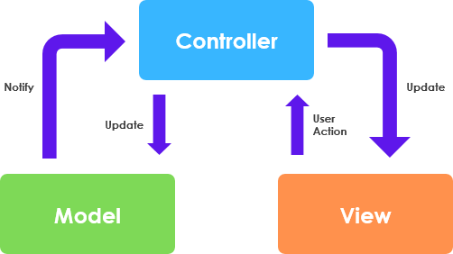

# Dokumentation
Detter er min egen dokumentation af java webstack.
Vi skal lave et intranet og vil bruge denne
dokumentation til bedre at kunne huske hvad vi lavede.

## start af et nyt webprojekt 

1. Opret nyt prokelt i intellij
2. Vælg JavaEE projektskabelon
3. Java + Maeven 
4. Servlet dependencies

## Arkitektur
Vi Anvender en slags MVC-pattern

- M(odel) - Entiteter og hjælpe- metoder og klasser.
- V(iew) - JSP og frontend(css, bootstrap mm)
- C(ontrol) - Servlets
- 
Husk! Ingen kommunikation mellem Model og View. Gå altid igennem controlleren